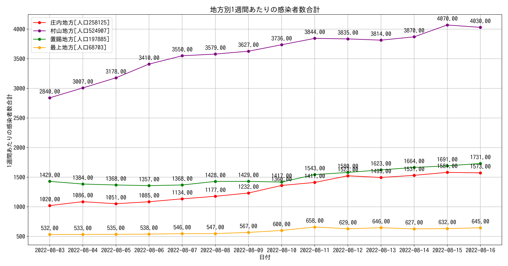
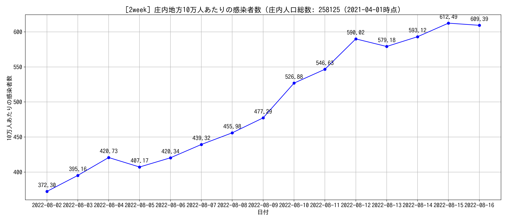
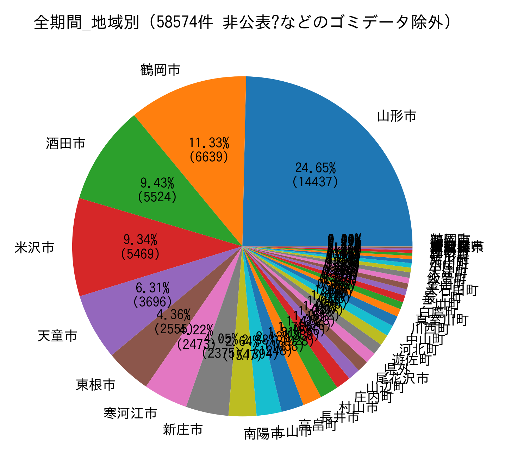
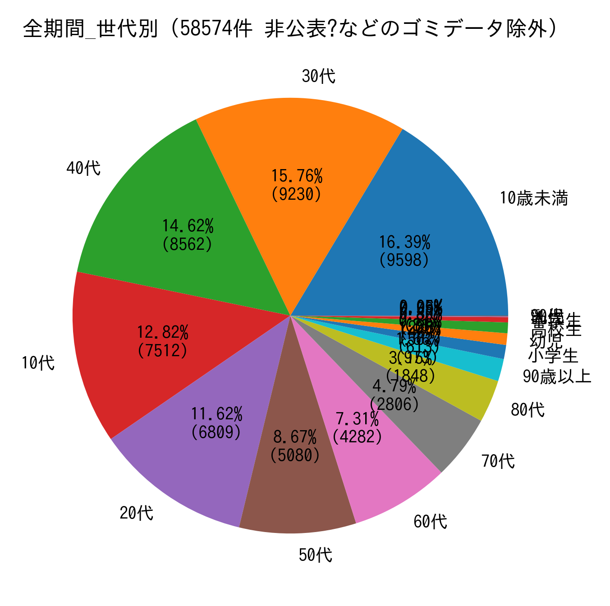

# COVID19-Yamagata (2021-06-24)

- 山形県のオープンデータを使用して発表データのサマリーを公表しています。（随時）
   - 県内全般の内容と庄内地方のデータを掲載しています。
- 出力は現在のところ画像になっていますが、いずれ再利用可能な状態にしたい(希望)

## 1. 前口上

### 1.1 データの取得元

- 時系列データ: [新型コロナウイルス感染症（COVID-19）について](https://www.pref.yamagata.jp/090016/bosai/kochibou/kikikanri/covid19/shingata_corona.html)
  - オープンデータとして提供されている 感染者属性 のCSVファイルを使用
  - 検査実施数は日付がズレているように見え、信頼できないため今は使用していない（いずれ陽性率を計算したいかも...）
  - 当日の発表データは手入力
- 人口データ: [山形県の人口と世帯数（推計）（令和3年5月1日現在）について](https://www.pref.yamagata.jp/020052/kensei/shoukai/toukeijouhou/jinkou/jinkm.html)
  - 人口データは 10万人あたりの感染者数を計算するために使用している
  - 令和3年5月時点のExcelデータを使用 (2021-06-04)
- プログラム
  - 開発言語: Python 3.8.5 (Conda: jupyter, pandas+matplotlib)
  - ソースコード: いずれ...（リファクタ中)
  - 計算結果のデータ: いずれ...

### 除外データ

- データとして年代などの値がない(NULL)ものは対象外としている
  - 具体的な除外データは[こちら](./images/exclusion_data.png)
    - `no` カラム == 山形県が発表している発表番号

## 2. 出力結果

### [直近1ヶ月] 地方別7日間移動平均

- プロットが飛んだり、移動平均が計算できない場合に描画されない問題を修正 (2021-06-05), 県内がゼロの場合の問題を修正 2021-06-13)

### [直近2週間] 感染者報告数 (山形県)

### [直近2週間] 感染者報告数 (地方別)

### [直近2週間] 感染者報告割合(年代別)

### [直近2週間] 感染者報告割合(地方別)

####  [直近1週間] 地方別10万人あたりの感染者数

### 庄内地方

- [直近2週間] 庄内市町村別の感染報告

- 上記グラフのテーブルビューとメモ

- [直近2週間] 庄内市町村別14日間移動合計

### その他参考的に出力しているもの

#### 直近1ヶ月の地方別10日間移動合計

- 7日よりも少し長い期間で確認したかったので作成

直近2週間分だけのグラフはこちらに

</img>

- [直近1週間] 地方別7日間移動合計

- [直近2週間] 庄内地方10万人あたりの感染者数

- [直近2週間] 庄内市町村別10万人あたりの感染者数
  - プロットされていない部分は2週間以上感染者報告がないことを示す

- [全期間] 感染者報告割合(地方別)

- [全期間] 感染者報告割合(年代別)

