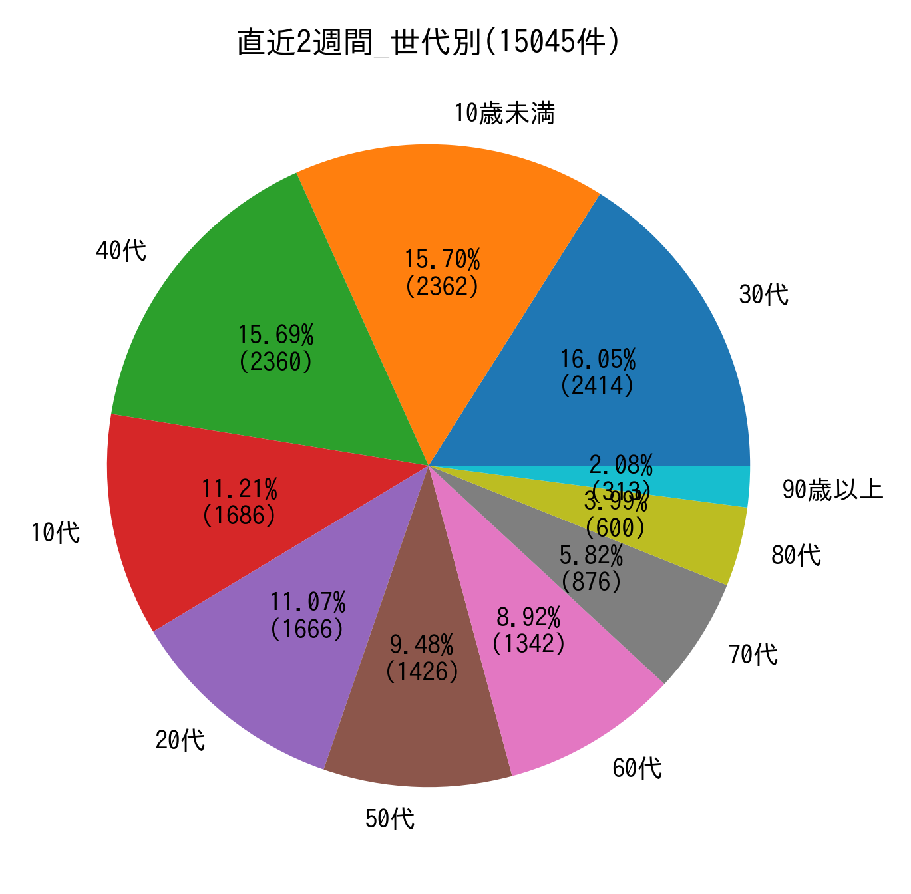
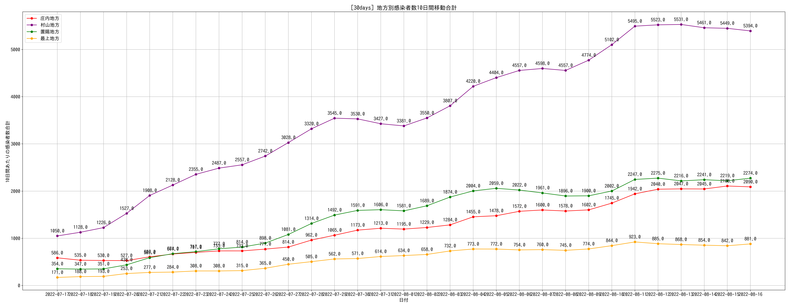

# COVID19-Yamagata

- 山形県のオープンデータを使用して発表データのサマリーを公表しています。（随時）
   - 県内全般の内容と庄内地方のデータを掲載しています。
- 出力は現在のところ画像になっていますが、いずれ再利用可能な状態にしたい(希望)

## 1. 前口上

### 1.1 データの取得元

- 時系列データ: [新型コロナウイルス感染症（COVID-19）について](https://www.pref.yamagata.jp/090016/bosai/kochibou/kikikanri/covid19/shingata_corona.html)
  - オープンデータとして提供されている 感染者属性 のCSVファイルを使用
  - 検査実施数は日付がズレているように見え、信頼できないため今は使用していない（いずれ陽性率を計算したい）
  - 当日の発表データは手入力
- 人口データ: [山形県の人口と世帯数（推計）（令和3年5月1日現在）について](https://www.pref.yamagata.jp/020052/kensei/shoukai/toukeijouhou/jinkou/jinkm.html)
  - 人口データは 10万人あたりの感染者数を計算するために使用している
  - 4月時点のExcelデータを使用
    - 5月の人口データが出ていることをさっき知った(後でやる)
- プログラム
  - 開発言語: Python (jupyter, pandas+matplotlib)
  - ソースコード: いずれ公開（コードが汚すぎるのでリファクタ後)
  - 計算結果のデータ: いずれ公開

### 除外データ

- データとして年代などの値がない(NULL)ものは対象外としている
  - 具体的な除外データは[こちら](./images/exclusion_data.png)
    - `no` カラム == 山形県が発表している発表番号

## 2. 出力結果

### [直近1ヶ月] 地方別7日間移動平均

- 庄内地方のプロットが飛んでいるのは7日以上感染者が出なかったため
  - ゼロプロットするように後で直す
- 同様に最上地方は移動平均のプロットになるだけの感染者が出ていないため、未プロット(こちらも要修正)

### [直近2週間] 感染者報告数 (山形県)

### [直近2週間] 感染者報告数 (地方別)

### [直近2週間] 感染者報告割合(年代別)

### [直近2週間] 感染者報告割合(地方別)

####  [直近1週間] 地方別10万人あたりの感染者数

### 庄内地方

- [直近2週間] 庄内市町村別の感染報告

- 上記グラフのテーブルビューとメモ

- [直近2週間] 庄内市町村別14日間移動合計

### 参考的に出力したもの

#### 直近1ヶ月の地方別10日間移動平均

- 7日よりも少し長い期間で確認したかったので作成
  - 直近2週間分だけのグラフは - [here](./images/10days_rollingsum_patients_2week.png)

#### 別途リンクのみ

- [直近1週間] 地方別7日間移動合計 - [here](./images/7days_rollingsum_1week.png)
- [直近2週間] 庄内地方10万人あたりの感染者数 [here](./images/14days_per_population_shonai.png)
- [直近2週間] 庄内市町村別10万人あたりの感染者数 [here](./images/14days_per_population_shonai_area.png)
  - 酒田市が5/31以降表示されていないのは2週間以上感染者報告がないことを示す
- [全期間] 感染者報告割合(地方別) - [here](./images/all_range_area.png)
- [全期間] 感染者報告割合(年代別) - [here](./images/all_range_age.png)